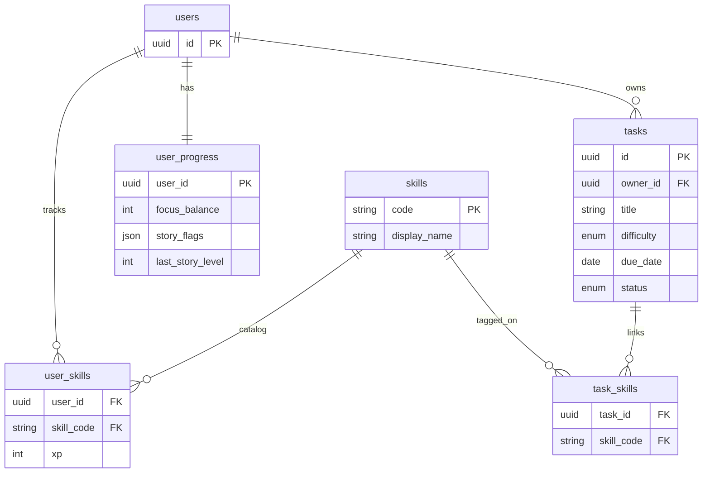
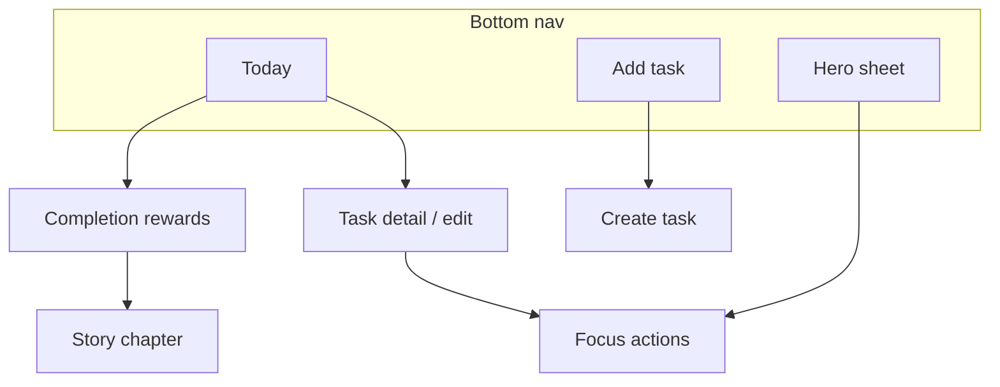
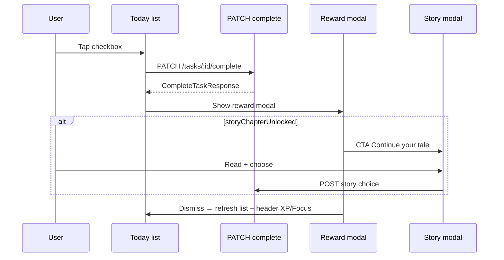

# Brainstorming Session Results

**Facilitator:** Luca
**Date:** 2026-05-28 11:20:57 (UTC+2)

## Session Overview

**Topic:** Browser-first (mobile primary) Habitica-like to-do app with deeper RPG elements; single-player; tasks grant skill XP and contribute to overall user level.

**Goals:** Generate ideas for gameplay loop, skill system, task types, progression math, UX flows, and an initial data model/API outline.

### Context Guidance

_(No additional context file provided for this session.)_

### Session Setup

- Target platforms: browser on mobile (primary) + desktop
- Target audience: people struggling to get things done, who like gaming/gamification mechanics
- Scope: single-player to start

## Technique Selection

**Approach:** AI-Recommended Techniques  
**Analysis Context:** Browser-first (mobile primary) Habitica-like to-do app with deeper RPG elements; single-player; tasks grant skill XP and contribute to overall user level, with focus on gameplay loop, skill system design, task types, progression math, UX flows, and initial data model/API outline.

**Recommended Techniques:**

- **Question Storming:** Surface unknowns/assumptions early (systems + UX + math + abuse cases) so we design the right loop.
- **Morphological Analysis:** Systematically explore combinations (task types × rewards × skills × failure modes × UI surfaces) to generate coherent feature bundles.
- **First Principles Thinking:** Rebuild from fundamentals (motivation + friction + meaning) to avoid shallow grind and create “deeper RPG” differentiation.

## Technique Execution (in progress)

### Question Storming

Questions captured (no answers yet):
- What should the user receive other than XP for a specific skill when completing a task?
- What can the player do with their character aside from growing skills?
- What skills should we select for the MVP?
- Should skills grant perks at specific level thresholds?
- Should the user be able to unlock “active skills” to help them in the game?
- Can we make do with just one task type for the MVP?
- What UX should we present to the user (to-do list + “character sheet” page, etc.)?
- What models do we need (bare minimum) to make this work?
- What are the relationships between the required models?
- What should be the formulas to compute skill levels and general level?

### Morphological Analysis (in progress)

**Dimension 2 chosen (Completion rewards beyond skill XP):**

**[Category #1]**: Quest Track With Choices
_Concept_: Completing tasks advances a personal “quest meter”; hitting milestones unlocks short story beats where the user chooses outcomes. Choices branch rewards (cosmetics, titles, questlines) and lightly shape the user’s “identity” (e.g., reputation tags) without heavy power creep.
_Novelty_: Makes productivity feel like narrative agency, not just points.

**[Category #4]**: Level-Up Chapter Beats (Heroic)
_Concept_: Story beats trigger at each new overall user level (level-up moment), delivering a short heroic chapter + a choice that influences flavor (titles, story flags, future chapter variants). In the future, users can select tone in settings.
_Novelty_: Reinforces progress at the exact moment motivation peaks (level-up), making the loop feel like an RPG “campaign” rather than chores.

**[Category #2]**: Focus Currency For Schedule Control
_Concept_: Completing tasks grants a limited “Focus” currency used for high-friction actions: reschedule overdue tasks without guilt penalties, “stabilize” a streak, or reassign a task’s skill tags to better reflect what you actually trained.
_Novelty_: Converts effort into control over the system (anti-shame mechanic), which is especially motivating for the target audience.

**[Category #5]**: Focus Currency Rules (Anti-Grind + Utility)
_Concept_: Earn Focus only from medium/hard task completions. Focus cap scales with overall level. Spend options in MVP: (a) reschedule overdue without penalty, (b) stabilize a streak / prevent one decay event, (e) boost next task’s XP once.
_Novelty_: Rewards “hard things” with practical self-management power, not just numbers; reduces shame spirals while preserving game-like scarcity.

**Dimension 3 chosen (Skill model):**

**[Category #3]**: SMART-like Tag-Based Skills
_Concept_: Skills are tag categories; each task links to 1–N skills and grants XP to all linked skills on completion. Skills level independently; overall user level is derived from aggregate skill XP (sum or weighted sum).
_Novelty_: Keeps the system flexible and user-driven while remaining legible on mobile (“this task trained X/Y/Z”).

**[Category #6]**: Overall Level = Total Skill XP (Non-Linear Curve)
_Concept_: Overall user level is derived from the sum of XP earned across all skills. XP required per level-up grows non-linearly (exponential-ish) with level, and level-ups trigger heroic story beats.
_Novelty_: Keeps progression legible and scalable while aligning narrative beats with meaningful milestones.

**Locked progression decisions (MVP):**

- **Multi-skill XP:** **Split (A)** — base XP is divided across linked skills (prevents tag-spraying abuse).
- **Level curve:** **Quadratic-ish (1)** — smoother early progression; can steepen later via tuning constant.

**Proposed formulas (tunable constants):**

| Constant | Role | Starter value |
|----------|------|----------------|
| `baseXp` | XP per difficulty | trivial 5, easy 10, medium 25, hard 50 |
| `a_skill` | Skill level curve (faster) | 25 |
| `a_user` | Overall level curve (slower) | 50 |
| `maxSkillsPerTask` | Cap tags per task | 3 |

- **Task completion:** `xpAward = baseXp[difficulty]`
- **Per linked skill:** `xpToSkill = xpAward / count(related_skills)` (min 1 skill)
- **Skill level:** `skillLevel = floor(sqrt(skillXp / a_skill))` — XP to reach skill level L ≈ `a_skill × L²`
- **Overall level:** `totalXp = sum(skillXp)`; `userLevel = floor(sqrt(totalXp / a_user))` — campaign level-ups are rarer; story beats stay meaningful
- **Pacing intent:** Same XP pool advances skills ~2× faster than overall level (ratio `a_user / a_skill = 2`)
- **Focus cap:** `focusCap = 5 + floor(userLevel / 2)`; earn +1 Focus on medium/hard completion only
- **Focus spend:** reschedule overdue (1), stabilize streak (2), boost next task +25% XP (1)

### MVP skill constellation (approved — 7 skills)

SMART/Skyrim-inspired names; each task links to **1–3** skills (split XP).

| Skill | One-line definition | Example tasks | Don’t use for |
|-------|---------------------|---------------|---------------|
| **Concentration** | Sustained attention on one important thing | Deep work block, study session, write report | Quick chores, social calls |
| **Vitality** | Body, energy, recovery | Workout, walk, meal prep, sleep routine | Mental-only admin |
| **Lore** | Learning and knowledge | Course module, read chapter, practice instrument | Routine errands |
| **Presence** | People and communication | Call family, meeting, networking, therapy | Solo coding |
| **Order** | Structure, planning, maintenance | Weekly review, inbox, clean desk, budget | Creative deep work |
| **Resolve** | Uncomfortable or high-friction actions | Hard email, appointment, “start the scary thing” | Easy habits |
| **Craft** | Practical execution and finishing | Fix leak, groceries, paperwork, deploy feature | Pure planning only |

**MVP set (locked):** Concentration, Vitality, Lore, Presence, Order, Resolve, Craft — max **3** tags per task; split XP across tags.

**Optional v2:** **Fortune** (Luck) — streak bonuses / surprise loot (defer; adds complexity).

**Perk hooks (later, not MVP):** Concentration L5 → longer boost; Resolve L3 → cheaper “stabilize streak”; Order L5 → cheaper reschedule.

### Data model (MVP) — XP source of truth

**Stored:** `user_skills.xp` per (user, skill). **Computed (not stored as source of truth):** skill level, overall user level, total XP.

- **Skill level:** `floor(sqrt(user_skills.xp / a_skill))` per skill row
- **Total XP:** `SUM(user_skills.xp)` for the user
- **User level:** `floor(sqrt(totalXp / a_user))`
- **Focus cap** uses computed `userLevel`

Optional cache on `user_progress` (e.g. `cached_user_level`, `cached_total_xp`) for reads — invalidate on task complete; MVP can compute on read if small scale.

**Task ↔ skill relationship:** explicit junction table `task_skills` (not embedded array on task row — easier to query, index, and enforce max 3 tags).



**On task complete (transaction):**
1. Read `task_skills` for `task_id`
2. `xpAward = baseXp[difficulty]`; `xpEach = xpAward / count(task_skills)`
3. `UPDATE user_skills SET xp = xp + xpEach` for each linked skill (upsert if missing)
4. Recompute levels; if `userLevel > last_story_level` → story beat + update `last_story_level`
5. If medium/hard → `focus_balance += 1` (cap check)

---

## Field-level schema (SQLite MVP)

Conventions: `TEXT` UUIDs (`id`), timestamps as ISO-8601 `TEXT` in UTC, `PRAGMA foreign_keys = ON`, all writes in transactions.

### `users`

| Column | Type | Constraints | Notes |
|--------|------|-------------|-------|
| `id` | TEXT | PK | UUID v4 |
| `created_at` | TEXT | NOT NULL | |
| `modified_at` | TEXT | NOT NULL | |
| `deleted_at` | TEXT | NULL | Soft delete (optional for MVP if single account) |

### `tasks`

| Column | Type | Constraints | Notes |
|--------|------|-------------|-------|
| `id` | TEXT | PK | UUID |
| `owner_id` | TEXT | NOT NULL, FK → `users(id)` | |
| `title` | TEXT | NOT NULL | Max length enforced in app (e.g. 200) |
| `description` | TEXT | NULL | |
| `due_date` | TEXT | NULL | `YYYY-MM-DD` (date only) |
| `difficulty` | TEXT | NOT NULL | `trivial` \| `easy` \| `medium` \| `hard` |
| `status` | TEXT | NOT NULL DEFAULT `open` | `open` \| `completed` \| `cancelled` |
| `completed_at` | TEXT | NULL | Set on complete |
| `created_at` | TEXT | NOT NULL | |
| `modified_at` | TEXT | NOT NULL | |
| `deleted_at` | TEXT | NULL | Soft delete; exclude from default lists |

**Checks (app or migration):** `completed_at` set iff `status = completed`.

### `skills` (seed catalog — 7 rows)

| Column | Type | Constraints | Notes |
|--------|------|-------------|-------|
| `code` | TEXT | PK | e.g. `concentration`, `vitality`, … |
| `display_name` | TEXT | NOT NULL | UI label |
| `description` | TEXT | NULL | Short help text |
| `sort_order` | INTEGER | NOT NULL | Constellation layout |
| `icon_key` | TEXT | NULL | Asset id |

### `task_skills` (junction)

| Column | Type | Constraints | Notes |
|--------|------|-------------|-------|
| `task_id` | TEXT | PK (composite), FK → `tasks(id)` ON DELETE CASCADE | |
| `skill_code` | TEXT | PK (composite), FK → `skills(code)` | |
| | | | **1–3 rows** per `task_id` (enforce in service layer) |

### `user_skills` (XP source of truth per skill)

| Column | Type | Constraints | Notes |
|--------|------|-------------|-------|
| `user_id` | TEXT | PK (composite), FK → `users(id)` | |
| `skill_code` | TEXT | PK (composite), FK → `skills(code)` | |
| `xp` | INTEGER | NOT NULL DEFAULT 0, CHECK (`xp` >= 0) | Level computed at read time |

### `user_progress` (meta + Focus currency)

| Column | Type | Constraints | Notes |
|--------|------|-------------|-------|
| `user_id` | TEXT | PK, FK → `users(id)` | 1:1 with user |
| `focus_balance` | INTEGER | NOT NULL DEFAULT 0, CHECK (`focus_balance` >= 0) | Currency (not the Concentration skill) |
| `story_flags` | TEXT | NOT NULL DEFAULT `'{}'` | JSON object: choice keys → values |
| `last_story_level` | INTEGER | NOT NULL DEFAULT 0 | Last user level that triggered a chapter |
| `modified_at` | TEXT | NOT NULL | |

Optional read cache (invalidate on complete): `cached_total_xp`, `cached_user_level`.

### Indexes

| Index | Columns | Purpose |
|-------|---------|---------|
| `idx_tasks_owner_active` | `(owner_id, status)` WHERE `deleted_at IS NULL` | Today / open lists |
| `idx_tasks_owner_due` | `(owner_id, due_date)` WHERE `deleted_at IS NULL` AND `status = 'open'` | Overdue sorting |
| `idx_task_skills_skill` | `(skill_code)` | Future: filter by skill |
| `idx_user_skills_user` | `(user_id)` | Load character sheet |

### Seed data (`skills`)

| code | display_name | sort_order |
|------|--------------|------------|
| concentration | Concentration | 1 |
| vitality | Vitality | 2 |
| lore | Lore | 3 |
| presence | Presence | 4 |
| order | Order | 5 |
| resolve | Resolve | 6 |
| craft | Craft | 7 |

---

## API DTOs (MVP)

Version prefix: `/api/v1`. Auth: session/cookie (TBD); all routes scoped to authenticated `user_id`. **DTOs are the contract** — do not expose raw DB rows.

### Shared enums

```ts
type TaskDifficulty = 'trivial' | 'easy' | 'medium' | 'hard';
type TaskStatus = 'open' | 'completed' | 'cancelled';
type SkillCode =
  | 'concentration' | 'vitality' | 'lore' | 'presence'
  | 'order' | 'resolve' | 'craft';
```

### `TaskDto` (read)

```ts
type TaskDto = {
  id: string;
  title: string;
  description: string | null;
  dueDate: string | null; // YYYY-MM-DD
  difficulty: TaskDifficulty;
  status: TaskStatus;
  skillCodes: SkillCode[]; // from task_skills, length 1–3
  completedAt: string | null; // ISO-8601
  createdAt: string;
  modifiedAt: string;
};
```

### `POST /api/v1/tasks` — create

**Request**

```ts
type CreateTaskRequest = {
  title: string;
  description?: string | null;
  dueDate?: string | null;
  difficulty: TaskDifficulty;
  skillCodes: SkillCode[]; // 1–3, unique
};
```

**Response `201`**

```ts
type CreateTaskResponse = { task: TaskDto };
```

**Errors:** `400` invalid skills count, unknown skill, validation.

### `GET /api/v1/tasks` — list

**Query:** `status=open|completed` (default `open`), `includeDeleted=false`.

**Response `200`**

```ts
type ListTasksResponse = { tasks: TaskDto[] };
```

### `GET /api/v1/me` — dashboard / character sheet

**Response `200`**

```ts
type SkillProgressDto = {
  code: SkillCode;
  displayName: string;
  xp: number;
  level: number; // floor(sqrt(xp / a_skill))
  xpToNextLevel: number; // (level+1)^2 * a_skill - xp
};

type MeResponse = {
  userId: string;
  totalXp: number;
  userLevel: number;
  xpToNextUserLevel: number;
  focusBalance: number;
  focusCap: number; // 5 + floor(userLevel / 2)
  skills: SkillProgressDto[]; // all 7, xp=0 if never trained
  storyFlags: Record<string, string | number | boolean>;
};
```

### `PATCH /api/v1/tasks/:taskId/complete` — complete task

**Request** (MVP — empty body ok)

```ts
type CompleteTaskRequest = {
  // optional v1.1: idempotency key for retries
  idempotencyKey?: string;
};
```

**Response `200`**

```ts
type SkillXpGainDto = {
  skillCode: SkillCode;
  xpGained: number;
  xpBefore: number;
  xpAfter: number;
  levelBefore: number;
  levelAfter: number;
  leveledUp: boolean;
};

type CompleteTaskResponse = {
  task: TaskDto; // status completed, completedAt set
  rewards: {
    baseXpAward: number;
    skillGains: SkillXpGainDto[];
    focusEarned: number; // 0 or 1 (medium/hard only)
    focusBalanceAfter: number;
  };
  progression: {
    totalXpBefore: number;
    totalXpAfter: number;
    userLevelBefore: number;
    userLevelAfter: number;
    userLeveledUp: boolean;
    storyChapterUnlocked: boolean; // userLeveledUp && level > last_story_level
    storyChapterId?: string; // e.g. "chapter-level-3"
  };
};
```

**Errors**

| Code | When |
|------|------|
| `404` | Task not found, wrong owner, or soft-deleted |
| `200` (idempotent) | Already `completed` — return **same** `CompleteTaskResponse` as first completion (safe for retries) |
| `422` | No `task_skills` rows (task must have 1–3 skills before complete) |

**Server rules (single transaction):**

1. Lock task + verify `owner_id`, `status = open`, `deleted_at IS NULL`
2. Load `task_skills`; fail if count ∉ [1, 3]
3. `baseXpAward = baseXp[difficulty]`; per skill `xpGained = floor(baseXpAward / n)`
4. Upsert `user_skills` (+xp each)
5. Recompute `totalXp`, `userLevel`; compare to `last_story_level` → set `storyChapterUnlocked`
6. If medium/hard: `focus_balance = min(focus_balance + 1, focusCap)`
7. Set task `status = completed`, `completed_at = now()`, `modified_at = now()`

### `POST /api/v1/me/focus/spend` — Focus currency (defer detail if needed)

**Request**

```ts
type FocusSpendAction =
  | { type: 'reschedule_overdue'; taskId: string; newDueDate: string }
  | { type: 'stabilize_streak' }
  | { type: 'boost_next_task'; taskId: string };

type FocusSpendRequest = FocusSpendAction;
```

**Response `200`:** `{ focusBalanceAfter: number; ...action-specific fields }`

**Costs:** reschedule `1`, stabilize `2`, boost `1` (per locked rules).

### Related CRUD (outline only)

- `PATCH /api/v1/tasks/:taskId` — update fields / skill tags (open tasks only)
- `DELETE /api/v1/tasks/:taskId` — soft delete (`deleted_at`)
- `POST /api/v1/story/:chapterId/choice` — record choice → merge into `story_flags`

---

## UX flows (MVP — mobile-first)

**Principles:** thumb-reachable actions, one primary screen (Today), reward feedback within 1s of complete, no shame copy on overdue, keyboard + screen-reader safe.

### Information architecture

**Bottom nav (mobile)**

| Tab | Label | Role |
|-----|-------|------|
| 1 | **Today** | Open + overdue tasks; primary complete loop |
| 2 | **Hero** | Character sheet (constellation), campaign level, Focus |
| — | **FAB `+`** | Quick-add task (center or trailing) |

**Desktop:** same IA; wider layout shows Today + Hero side-by-side optional later.



---

### Flow 1: First open / empty state

1. User lands on **Today** (no onboarding gate for MVP).
2. **Empty state:** “No quests yet” + CTA **Add your first task** + one-line explainer (tasks train skills → level up your hero).
3. Optional: single tooltip on FAB (“Tasks grant XP to skills you choose”).

---

### Flow 2: Today (primary loop)

**Layout (top → bottom)**

1. **Header:** Campaign level + XP bar to next level; Focus pill (`⚡ 3/8` — tap opens Focus actions sheet).
2. **Overdue** (collapsed by default if empty): red/neutral badge count; expand list; each row: title, due date, difficulty chip, skill icons.
3. **Today / Open:** sorted by due date (nulls last), then difficulty.
4. **Task row:** checkbox (large tap target), title, difficulty, 1–3 skill icons, due date if set.

**Actions**

- Tap row (not checkbox) → **Task detail** (edit).
- Tap checkbox → **Complete** (see Flow 3).
- Swipe or overflow → Edit / Delete (soft) / **Reschedule** (if overdue + has Focus → Flow 6).

**States**

- Loading: skeleton rows.
- Error: retry banner.
- All done: celebratory empty “Quest board clear” + link to Hero sheet.

---

### Flow 3: Complete task → rewards (core dopamine loop)



**Steps**

1. Optimistic UI optional: checkbox animates; disable row until response (or optimistic with rollback).
2. **Reward modal (full-screen sheet on mobile):**
   - Headline: “Quest complete!”
   - Per skill: icon, name, `+XP`, level-up badge if `leveledUp`
   - If Focus earned: “+1 Focus” with current balance
   - Campaign bar: progress toward next level; if `userLeveledUp`: **Level up!** banner
3. **Primary CTA:** `Continue` (dismiss). **Secondary:** if `storyChapterUnlocked` → `Read chapter` (opens Flow 4).
4. **Idempotent retry:** if network retries, same modal data — no double animation (compare `completedAt` or idempotency).

**Edge cases**

- `422` no skills: block complete at create time; if somehow hit, toast “Add skills before completing” → open edit.
- Already completed (idempotent 200): dismiss quietly or show “Already completed” mini-toast.

---

### Flow 4: Story chapter (on user level-up)

**Trigger:** `progression.storyChapterUnlocked === true` from complete response (or from Hero sheet if unread).

**Screen**

1. Heroic tone copy (short paragraph, scrollable).
2. **Choice** (2 options MVP): buttons, not timed.
3. On submit → `POST /api/v1/story/:chapterId/choice` → update `storyFlags` → show flavor reward (title string, e.g. “The Steadfast”).
4. CTA **Return to Today**.

**Later:** tone in Settings; branch variants from `story_flags`.

---

### Flow 5: Create / edit task

**Create (FAB)**

1. **Quick sheet:** title (autofocus), difficulty (default `easy`), skill chips (require 1 before save), optional due date.
2. **Save** → `POST /tasks` → insert at top of Today.
3. **Expand:** “More details” → description field.

**Edit (tap row)**

- Same form; open tasks only.
- Skill chips: 1–3 enforced; changing skills does not retroactively alter past XP.
- Delete → confirm → soft delete.

**Validation UX**

- Save disabled until title + ≥1 skill.
- Max 3 skills: disable unselected chips with tooltip.

---

### Flow 6: Hero sheet (character / constellation)

**Layout**

1. **Top:** Avatar placeholder, **Campaign level**, total XP, bar to next level.
2. **Constellation:** 7 nodes (seed layout); node size/brightness ∝ skill level; tap node → bottom sheet with skill detail (level, XP bar, recent gains optional v2).
3. **Focus block:** balance / cap; button **Use Focus** → action sheet:
   - Reschedule overdue task (pick task + date) — cost 1
   - Stabilize streak — cost 2
   - Boost next task (+25% XP) — cost 1, pick open task
4. **Story** (optional): link “Chronicle” → list of unlocked chapters / flags (MVP can be single “last chapter” replay).

**Data:** `GET /me` on tab focus; refresh after complete.

---

### Flow 7: Focus — reschedule overdue (anti-shame)

**Entry:** Overdue row action, or Hero → Use Focus → Reschedule.

1. Show cost: “Spend 1 Focus to reschedule without penalty.”
2. Date picker (defaults tomorrow).
3. `POST /me/focus/spend` + `PATCH` task `due_date`.
4. Toast: “Quest rescheduled. No penalty.” — task moves out of overdue styling.

**Copy rule:** never “you failed”; use “reschedule”, “recover”, “replan”.

---

### Flow 8: Focus — boost next task

1. User selects open task.
2. Confirm: “Next completion gains +25% XP.”
3. Server sets flag on user or task (`boosted_task_id`) until consumed on next complete.
4. Reward modal shows boosted XP line item.

---

### MVP screen checklist

| Screen / sheet | Priority |
|----------------|----------|
| Today list | P0 |
| Reward modal | P0 |
| Create task sheet | P0 |
| Hero / constellation | P0 |
| Task edit | P0 |
| Story chapter modal | P0 |
| Focus action sheet | P1 |
| Chronicle (story history) | P2 |

### UX decisions (locked)

1. **Complete interaction:** checkbox only for MVP (no swipe-to-complete).
2. **Overdue:** collapsible section on **Today** when overdue count > 0 (hidden when zero).
3. **Boost:** visible buff icon on task row while `boosted_task_id` is active.
